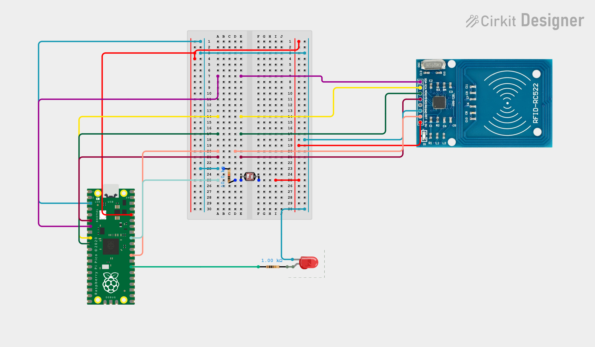

# Instructivo para el taller 1. 

## Proposito del taller:  

El siguiente taller se crea con la intencion de modelar un diseño de programacion orientada a objetos, que se relaciona con un sistema embebido, esto se hace mediante un diseño en el cual, el microcontrolador recibe instrucciones de un script de C#, y devuelve resultados despues de ejecutar dichas instrucciones para que dicho archivo de C# las procese devuelta. 

# Materiales: 

| Material | Costo aproximado  | Link respectivo | 
| ---------| ---------------------------|-----------------| 
| LDR      | 0.80 (USD)                   | https://www.microjpm.store/products/ad445?_pos=1&_psq=LDR&_psid=7e522a72a&_ss=e| 
| Resistencia (10kOhm) | 0.04 (USD) | https://www.microjpm.store/products/ad9989?_pos=1&_sid=0e90eca84&_ss=r | 
| Resistencia (1kOhm) | 0.13 (USD) | https://www.microjpm.store/products/ad11379?_pos=1&_sid=db6895844&_ss=r| 
| Raspberry pi pico w | 10500 (colones) | https://electrocr.tech/tienda/rasp-picow-gen/ | 
| MFRC - 522 RFID | 8.95 (USD) | https://www.microjpm.store/products/ad12562?_pos=1&_psq=RFID&_psid=b9d55138a&_ss=e | 
| led (cualquier color) | 0.17 (USD) | https://www.microjpm.store/products/ad7796?_pos=5&_sid=4066b44c7&_ss=r| 
| jumpers macho macho | 4.80 USD | https://www.microjpm.store/products/ad1130?_pos=1&_sid=3d89a3c82&_ss=r | 
| jumpers macho hembra | 2.20 USD | https://www.microjpm.store/products/ad641?_pos=3&_sid=3d89a3c82&_ss=r| 
|Protoboard| 5.80 (USD) | https://www.microjpm.store/products/ad368?_pos=3&_sid=524843e0e&_ss=r | 

# Diagrama del circuito: 

# Pinout: 

| Pin Rasp | Elemento al que se conecta | 
| ---------| ---------------------------|
|(3) GND   | Tierra del protoboard | 
|(6) GP4   | MISO (CFRID) | 
|(7) GP5   | SDA (CFRID) |  
|(9) GP6 |  SCK (CFRID) | 
|(10) GP7 | MOSI (CFRID)| 
|(36) 3V3 | (+) del protoboard | 
|(32) GP27 | nodo entre R y LDR | 
|(29) GP22 | RST (CFRID) | 
|(27) GP21 | conectado a R - LED| 

# Instrucciones iniciales: 
El repositorio con los códigos necesarios será compartido durante la practica o con algunos días de anticipación.

* Armar el circuito conforme al diagrama
* Usando el IDE thonny inserte rasp.py en la raiz del microcontrolador. 
* Usando el IDE thonny inserte el archivo mfrc522.py en la carpeta lib/ del microcontrolador ya que este archivo es necesario para poder hacer uso de la MRFID
* Descargar el template en C# que luego sera modificado durante el taller. 
* Ejecutar el codigo en la raspberry. 
* Ejecutar el codigo de C# una vez el puerto esta desocupado, para desocupar el puerto el IDE de Thonny tiene que quedar completamente cerrado antes de ejecutar el archivo en C# para permitir la comunicacion entre el archivo y la raspberry. 

# Notas: 
Estas instrucciones solo tienen que ser llevadas a cabo durante el inicio del taller, no se requiere que se hagan desde antes. 

Usualmente, puede que al ejecutar el archivo de C# este retorne que el puerto COM 
aun esta ocupado, para esto lo mejor es que en vez de cerrar Thonny de manera normal, realicen los siguientes pasos: Run -> Disconnect. Si el puerto sigue sin liberar, desconecten la USB, esperen unos segundos y vuelvanla a conectar. 

